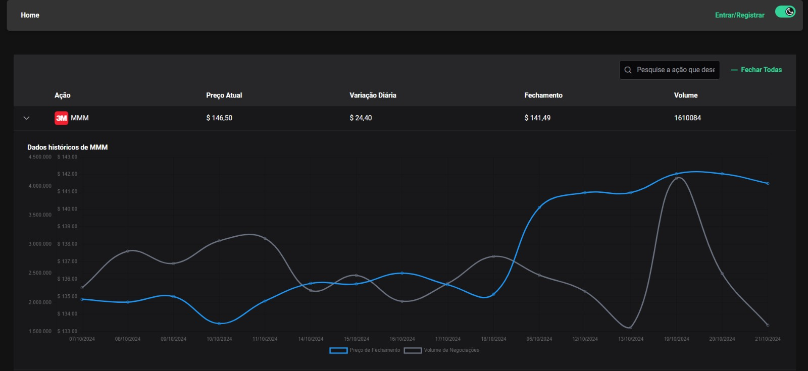
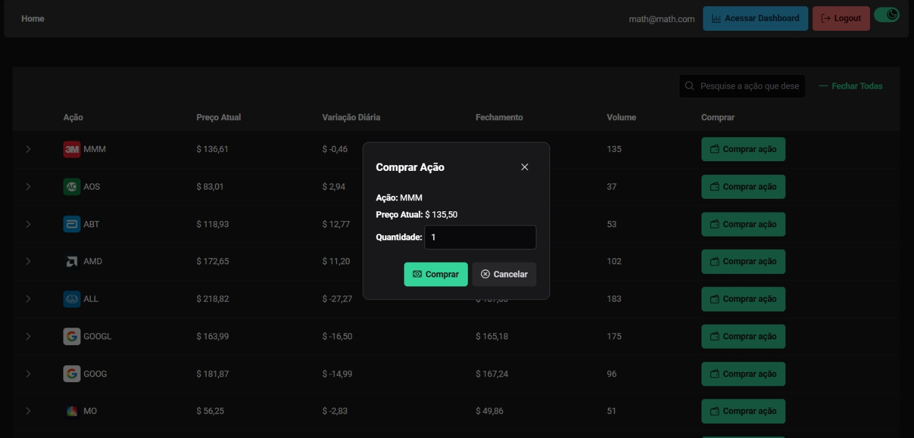
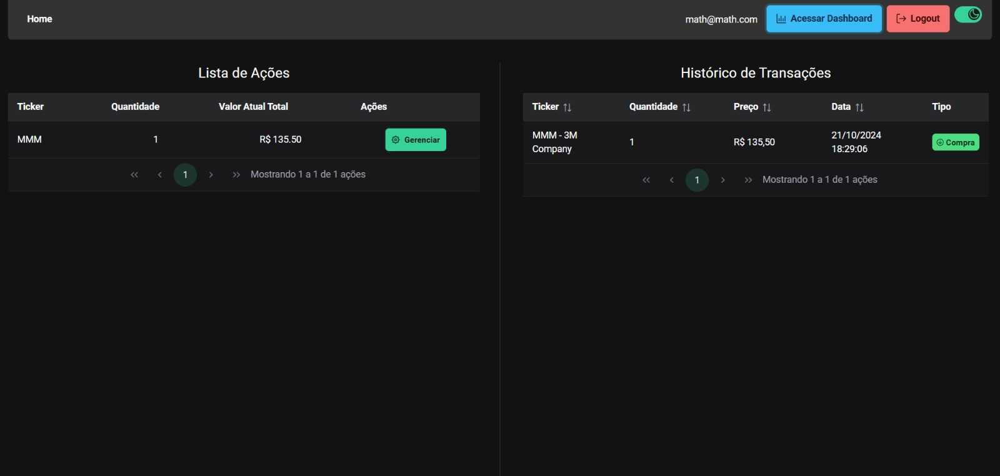
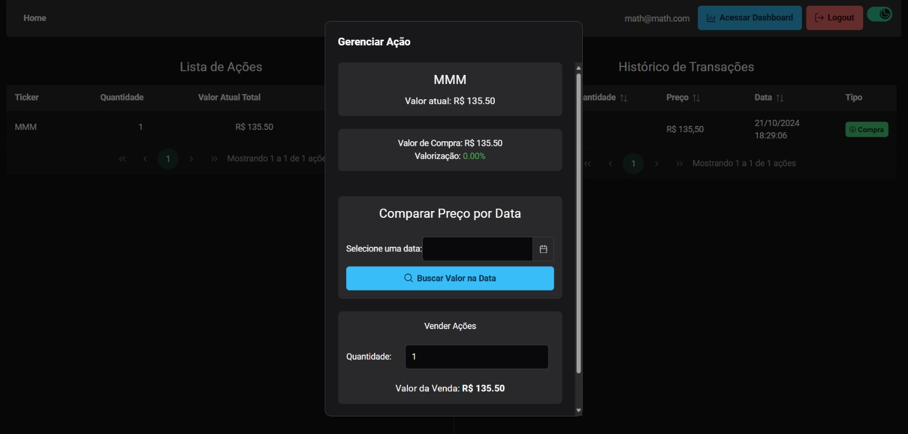
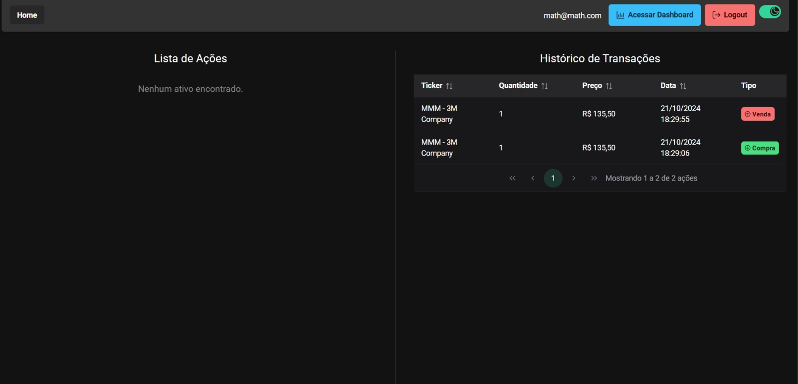

# InvestSim 💰

## Nosso projeto

### Home

### Lista de ações do usuário

### Lista de ações do usuário

### Gerenciamento da ação com predição dos dados

### Histórico de transações do usuário

## Descrição

"InvestSim" é uma corretora de investimentos que oferece uma interface web (SPRING) para gerenciamento de investimentos
em ações. O projeto foi desenvolvido com JAVA e SPRING, utilizando bibliotecas externas para adminstração de banco de dados, variáveis de ambiente e testes.
O projeto tem como inovação o uso de Machine Learning sendo capaz de analisar, auxiliar e prever com mais de 95% de precisão as tendências de mercado, para que seu dinheiro seja investido com mais segurança e eficácia.

## Tecnologias Utilizadas
- **Java**: Linguagem de programação principal utilizada para desenvolver a lógica do sistema.

- **Spring Framework**: Ecossistema de desenvolvimento para facilitar a criação de aplicações Java utilizando diversos módulos independentes.

- **JUnit**: Biblioteca utilizada para fazer testes unitários no código do projeto.

- **Mockito**: Utilizado para criar mocks durante a execução de testes, facilitando o isolamento de componentes.

- **DeepLearning4Java**: Utilizado para fazer a predição dos dados.

- **Univocity**: Biblioteca focada em processamento de CSVs.

- **PostgreSQL**: Banco de dados robusto para melhor gerenciamento de grandes quantidades de dados.

## Regras de negócio do projeto
- **RN1**: Escolher um arquivo CSV com dados reais disponíveis online:
- **RN2**: Utilizar Streams para ler, Filter, Reduce, Map.
- **RN3**: Possibilidade de análise, ter liberdade para explorar, ler e manipular dos arquivos usando as técnicas aprendidas no módulo.
- **Objetivo**:
    - Aplicar programação funcional (usando map, filter, reduce) no processamento de dados reais.
    - Desenvolver habilidades de manipulação de arquivos CSV com Streams.
    - Praticar a lógica e a análise de dados em um cenário realista.

## Instalação
### Pré-Requisitos
- Java Development Kit (JDK) instalado.
- IDE (como IntelliJ IDEA) configurada para desenvolvimento em Java.
- Baixar o CSV [sp500_data.csv](https://www.kaggle.com/datasets/joebeachcapital/s-and-p500-index-stocks-daily-updated) na pasta resources/data

- ## Uso
A aplicação permite o gerenciamento de ações, portfólio, e variações das ações das empresas selecionadas. As seguintes funcionalidades estão disponíveis:

- **Gerenciamento de ações**:
    - Compra, venda e administração das ações compradas.
    - Consulta de preço de mais das 500 maiores empresas do mercado (S&P500).

- **Autenticação de Usuários**:
    - Usuários podem se registrar e fazer login, sendo pessoa física ou juridica.
    - Autenticação de usuários com Spring Security.

-**Análise precisa e predição com Machine Learning**:
- Usuários podem analisar as tendências de mercado com precisão e segurança de onde aplicar seu dinheiro em ações, graças a um treinamento de MAIS de 40 anos de dados com movimentações
  de valores das ações.

## 🛠 Desafios e Soluções

Durante o desenvolvimento do projeto **InvestSim**, enfrentamos e superamos diversos desafios técnicos, o que resultou em um código muito melhor estruturado do que o do último módulo, onde
a equipe se preocupou em superar e subir o nível dos requisitos e entrega designados pelo professor.

### Principais Desafios:

1. **Autenticação de usuários com SPRING SECURITY**
- Implementamos uma autenticação eficiente utilizando a biblioteca Spring Security, que faz todo gerenciamento de autenticação do usuário.

2. **Tratamento de dados de forma efetiva**
- Por serem muitos dados é difícil entrega-los com agilidade para o usuário;

3. **Gerar os modelos de Predição:**
- Como eram muitas empresas diferentes e muitos dados a tratar, foi um pouco difícil de gerar modelos precisos que atendessem a nossa exigência de precisão.